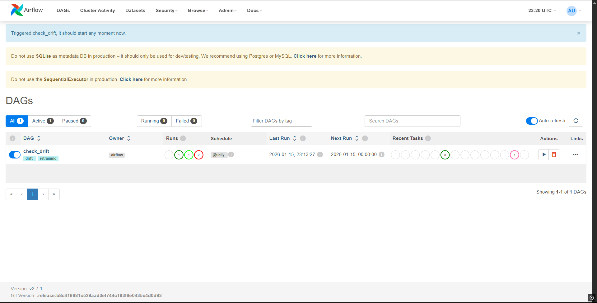
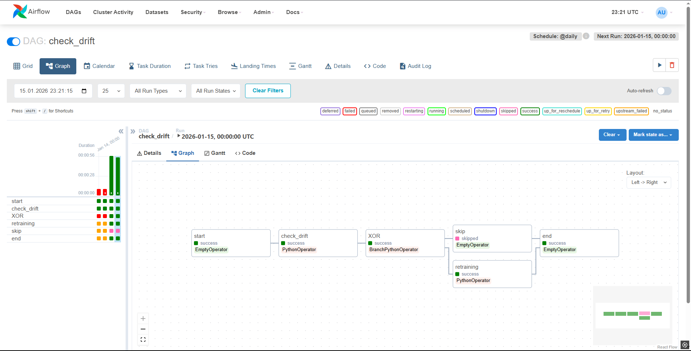
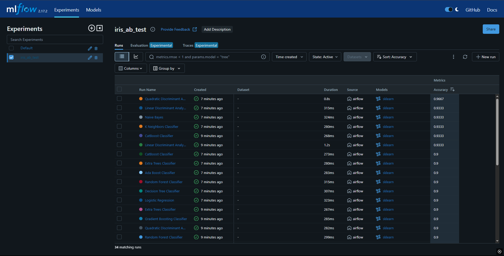
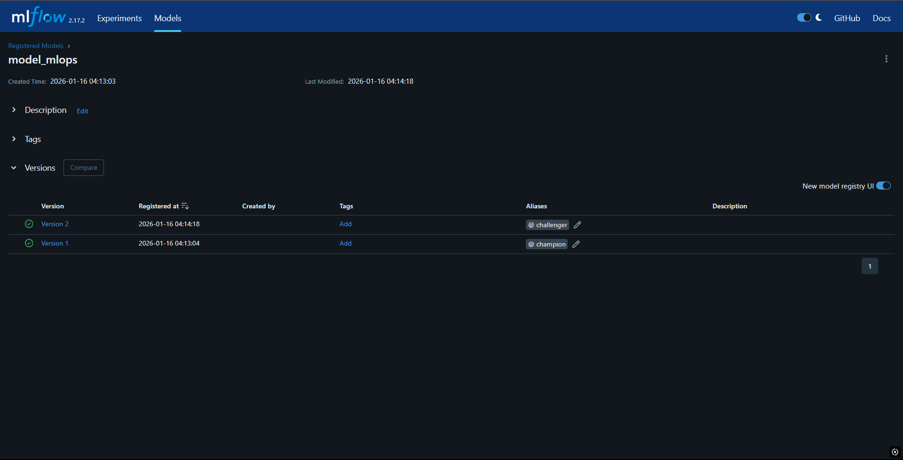
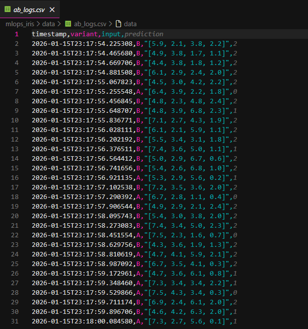
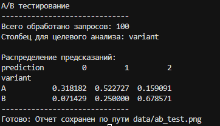

# ML-процесс от мониторинга до A/B теста  
## Цель задания  
Научиться строить полный production-процесс автоматического переобучения ML-моделипри обнаружении data drift, автоматического выбора лучшей модели с помощью PyCaret (AutoML), регистрации ее в MLflow Registry и проверки ее качества на реальных данных через A/B-тест с Flask-роутером  
## Обзор файлов репозитория  
1. **ML инфраструктура**
   - _docker-compose.yml_ - разворачивает и связывает между собой все сервисы
   - _Dockerfile.airflow_ и _Dockerfile.flask_ - инструкция по сборке образов
   - _requirements.txt_ - список библиотек необходимых для работы
2. **Автоматизация и мониторинг**
   - _ml_pipeline.py_ - описание графа задач (DAG) для Airflow. Управляет расписанием, проверяет наличие дрифта и решает, нужно ли запускать переобучение
   - _drift_retrain.py_ - содержит функции для обнаружения дрифта данных и логику AutoML через PyCaret для создания новой, более актуальной версии модели
3. **Сервис предсказаний**
   - _main.py_ - Flask-сервер, принимает запросы, подгружает нужные запросы из MLflow и распределяет трафик между ними для A/B теста
4. **Тестирование и аналитика**
   - _testing.py_ - скрипт, генерирующий 100 случайных запросов к API, чтобы получить данные для дальнейшей обработки
   - _analysis.py_ - читает логи, считает статистику и генерирует итоговый график
## Установка и запуск  
1. **Клонируйте репозиторий**
```bash  
git clone https://github.com/whytechh/mlops_final.git  
cd mlops_final  
```
2. **Постройте инфраструктуру**
```bash
docker-compose up -d --build
```
3. **Сымитируйте нагрузку**
```
python testing.py
```
Также есть динамическое управление долей трафика  
```bash
curl -X POST http://localhost:8080/config \
  -H 'Content-Type: application/json' \
  -d '{"ab_split_b": 0.3}'
```
4. **Сгенерируйте график сравнения моделей**
```bash
python analysis.py
```
## Результаты работы  

*Экран выполненного DAG*

*Граф логики*

*История запусков обучения и метрики*

*Версии модели с метками champion (A) и challenger (B)*

*Сырые логи A/B теста*

*Консольный отчет по распределению предсказаний*

